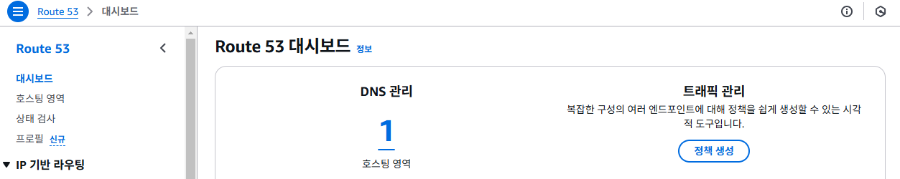
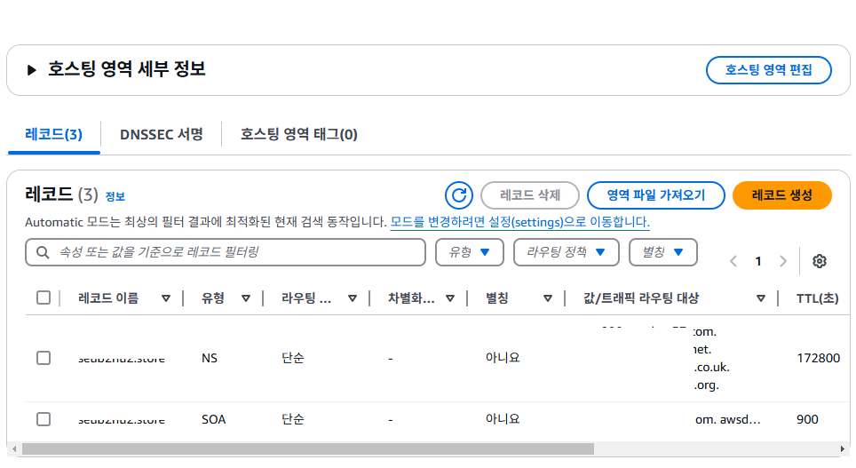

# AWS에 스프링 애플리케이션 배포

## EC2 인스턴스 생성하기

## EC2 인스턴스 자바 애플리케이션 실행 환경 구성하기

1. jdk 설치하기

    ```bash
    # 패키지 목록을 업데이트하고, 시스템을 업그레이드 한다.
    sudo apt update && sudo apt upgrade -y

    # jdk 21을 설치한다.
    sudo apt install openjdk-21-jdk -y

    # 설치된 자바 버전을 확인한다.
    java -version

    # 출력 예시
    # ubuntu@ip-10-0-0-108:~$ java -version
    # openjdk version "21.0.5" 2024-10-15
    # OpenJDK Runtime Environment (build 21.0.5+11-Ubuntu-1ubuntu124.04)
    # OpenJDK 64-Bit Server VM (build 21.0.5+11-Ubuntu-1ubuntu124.04, mixed mode, sharing)
    ```

2. git 설치하기

    ```bash
    # 패키지 목록을 업데이트 한다.
    sudo apt update

    # git을 설치한다.
    sudo apt install git -y 

    # 설치된 git 버전을 확인한다.
    git --version

    # git 사용자정보를 설정한다.
    git config --global user.name "이름"
    git config --global user.email "이메일주소"
    ```

## EC2 인스턴스에서 스프링 애플리케이션 실행하기

1. github에서 소스 내려받기

    ```bash
    # git clone로 github 저장소 내려받기
    git clone https://github.com/계정명/저장소이름.git

    # 디렉토리 변경하기
    cd 저장소이름
    ```

2. 스프링 애플리케이션 실행하기

    ```bash
    # maven
    sudo ./mvnw spring-boot:run &

    # gradle
    sudo ./gradlew bootRun &
    ```

3. 추가사항

    - 보안상의 이유로 application.properties에 설정값을 직접 설정하지 않고, 실행싯점에 값을 전달하는 경우

    - application.propertis 설정

        ```properties
        aws.credential.access.key=${ACCESS_KEY}
        aws.credential.secret.key=${SECRET_KEY}
        ```

    - 실행싯점에 값 전달하기

        ```bash
        sudo ./gradlew bootRun --args="--ACCESS_KEY=AWS엑세스키 --AWS_SECRET_KEY=AWS시크릿키" &
        ```

## EC2 인스턴스에 도메인 연결하기 (가비아 기준)

1. [가비아](https://www.gabia.com/)에서 도메인을 등록한다.

2. AWS의 "Route 53" 서비스에 접속한다.

3. "Route 53"의 메뉴에서 "호스팅 영역"을 선택한다.


4. "호스팅 영역" 화면에서 "호스팅 영역 생성"버튼을 클릭한다.


5. "호스팅 영역 생성" 화면에서 도메인 이름을 입력하고, "호스팅 영역 생성" 버튼을 클릭한다. 도메인 이름은 가비아에서 등록한 도메인 이름을 입력한다.


6. "호스팅 목록"에서 생성된 호스팅 영역을 확인한다.


7. "호스팅 목록"에서 생성된 호스팅을 클릭해서 "호스팅 영역 세부 정보" 화면으로 이동한다.


8. "호스팅 영역 세부 정보"의 레코드 중에서 아래의 정보를 복사한다.


9. 가비아에 접속 -> My가비아 -> 서비스 관리를 클릭한다.

10. 서비스 관리에서 등록된 도메인을 확인하고 "관리" 버튼을 클릭한다.


11. "도메인 정보" 조회 화면에서 네임서버 "설정"버튼을 클릭한다.


12. "네임서버"설정 화면의 각 입력필드에 8번 항목에서 복사한 값을 하나씩 입력한다. 입력할 때 주소 끝의 "."은 입력하지 않는다.


13. "호스팅 영역 세부 정보"에서 "레코드 생성"버튼을 레코드 생성 화면을 열고, 아래와 같이 정보를 입력하고, "레코드 생성"버튼을 클릭한다.


14. "호스팅 영역 세부 정보"의 레코드 목록에서 새로 추가된 레코드를 확인할 수 있다.


15. 도메인 연결 후 즉시 반영되지 않기 때문에, 1시간 혹은 2~3일 경과 후 도메인명으로 접속가능해 진다.

## EC2 인스턴스에 젠킨스 실행환경 구성하기

1. git 설치하기

    ```bash
    # 패키지 목록을 업데이트 한다.
    sudo apt update

    # git을 설치한다.
    sudo apt install git -y 

    # 설치된 git 버전을 확인한다.
    git --version

    # git 사용자정보를 설정한다.
    git config --global user.name "이름"
    git config --global user.email "이메일주소"
    ```

2. 젠킨스 설치하기

    최신 버전의 Jenkins를 설치하기 위해 공식 Jenkins 레포지토리를 추가한다.

    ```bash
    # GPG 키를 추가한다.
    curl -fsSL https://pkg.jenkins.io/debian/jenkins.io-2023.key | sudo tee \
    /usr/share/keyrings/jenkins-keyring.asc > /dev/null

    # 레포지토리를 추가한다.
    echo "deb [signed-by=/usr/share/keyrings/jenkins-keyring.asc] \
    https://pkg.jenkins.io/debian binary/" | sudo tee \
    /etc/apt/sources.list.d/jenkins.list > /dev/null

    # 패키지 목록을 업데이트 한다.
    sudo apt update

    # 젠킨스를 설치한다.
    sudo apt install jenkins -y

    # 젠킨스 서비스를 시작시킨다.
    sudo systemctl start jenkins

    # 젠킨스가 시스템 부팅 시 자동으로 시작되도록 설정한다.
    sudo systemctl enable jenkins

    # 젠킨스 실행 상태를 확인한다.
    sudo systemctl status jenkins

    # 출력 예시
    # ● jenkins.service - Jenkins Continuous Integration Server
    #       Loaded: loaded (/usr/lib/systemd/system/jenkins.service; enabled; preset: enabled)
    #       Active: active (running) since Tue 2024-12-10 06:33:57 UTC; 52s ago
    #     Main PID: 10933 (java)
    #        Tasks: 39 (limit: 1130)
    #       Memory: 310.2M (peak: 406.0M)
    #          CPU: 16.628s
    #       CGroup: /system.slice/jenkins.service
    ```

3. 웹 브라우저에서 Jenkins에 접속한다.

4. 초기 관리자 비밀번호를 입력한다.

5. 초기 설정 마법사를 따라 플러그인 설치 및 관리자 계정 생성을 완료한다.
